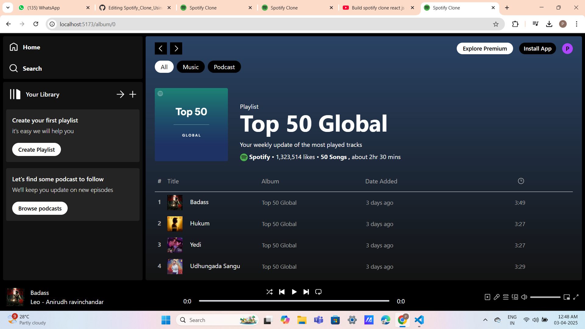

# Spotify App 🎶

A feature-rich **Spotify App** built with **React.js**, allowing users to explore music, manage playlists, and enjoy a seamless listening experience.

## Features ✨
- **Playback Controls**: Play, pause, and skip tracks.
- **Navigation**: Smooth routing with React Router.
- **State Management**: Uses **Context API** or local state.

## Technologies Used 💻
- **React.js** ⚛️
- **React Router** 🛤️
- **Context API** 🏗️
- **Styled Components / tailwind CSS** 🎨

## Homepage 

## Display page

